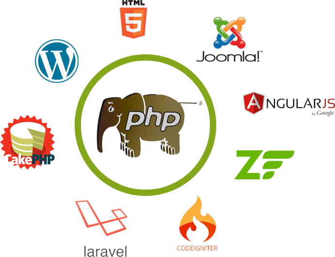

## Hi 👋, As a Software Engineer and Cyber Security Expert, I'm working at Arena Web Security.

  
  

#### Now

- :fire: Now working in DevOps and Cloud engineering;
- :calendar: Looking for contributing to cybersecurity related python based open source projects 

#### Bio

- 🏢 I'm currently working at **Arena Web Security**
- ⚙️ I use daily: `.py`, `.php`, `.sql`, `.js`, `.yml`, `.sh`
- 🌍 I'm mostly active within the **Python Community**
- 🌱 Learning all about **DevOps & Cyber Security**
- 💬 Ping me about **Django**, **Python**, **Docker**, **RestAPIs**, **PHP**, **WordPress**
- 📫 Reach me in Twitter: [@md_jewele](https://twitter.com/md_jewele)
- 📝 Checkout my [Resume](files/resume.pdf).

#### My Current Stack

         

#### Development Stuffs:

<b>⚡ Github Stats</b>

 

#### Recent Activity

<b> &#9749; Latest Medium Blogs</b>

<a target="_blank" href="https://www.linkedin.com/pulse/how-deploy-django-project-heroku-app-md-jewele-islam/">

#### Connect With Me

 
 

